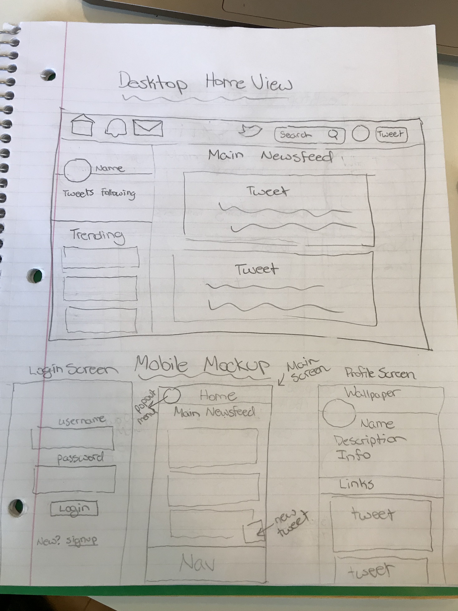
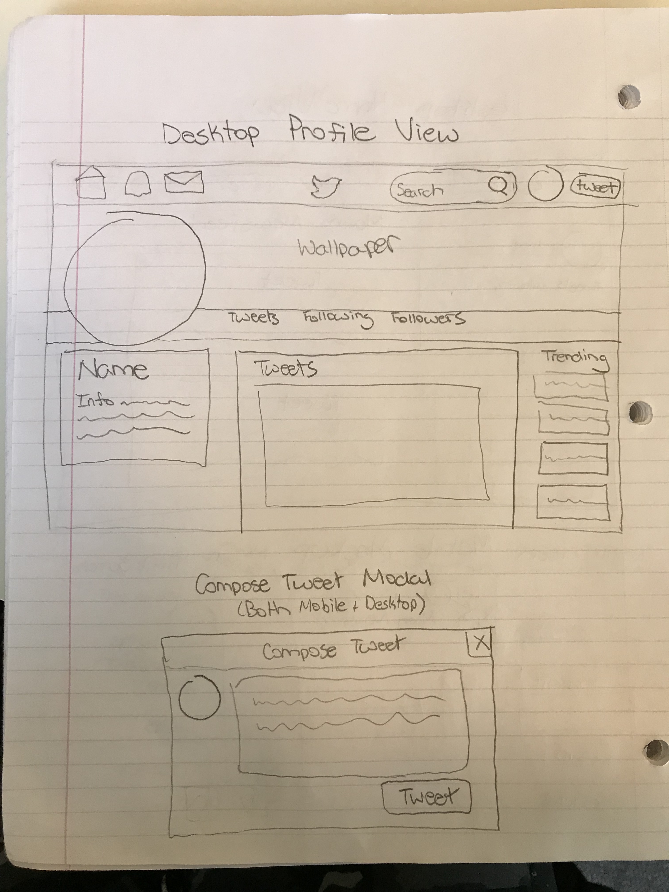
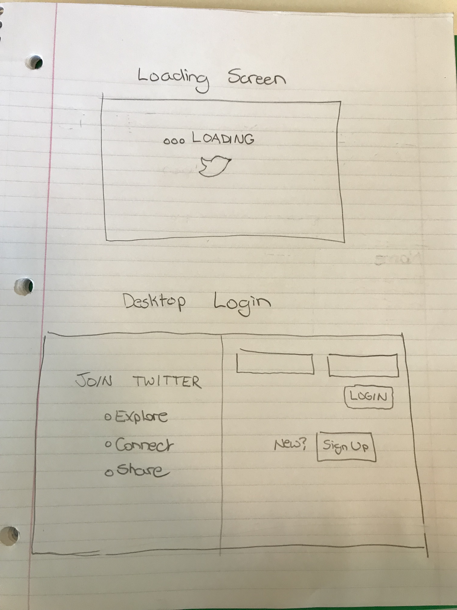

 # User Personas 

 
 # User Stories

1. As Jake, the wannabe influencer, I want to grow my YouTube following so I can make money being an influencer.
 *Include hashtags and “Who to Follow” recommendations; ability to share/like/interact with tweets
2. As Mon & Pop Ice Cream Shop, I want to spread awareness about my business so that I can help my local economy.
 * Allow location filtering; allow website or about section for a user; include a tutorial for new users
3. As Big Co., Ltd., I want to share company news (new products) so that my company stays relevant.
* Include hashtags, ways for community to interact with Big Co. Ltd (like, reply, favorite, RT), pinned tweet 
4. As Tim the tech recruiter, I want to highlight dev talent so that I can build a better tech community.
* Retweets, liking, pinning
5. As Kate Brown the “local” gov, I want to connect with my constituents so that I can get re-elected forever and ever.
* Allow location filtering
6. As Kim Kardashian, the socialite, I want to build my following so that I can increase my revenue.
* Ads, verify accounts
7. As ESPN, I want to highlight new talent so that I can help them become relevant.
* Tag people/allow following
8. As Amtrak, I want to give quick on-demand updates on my delays, so that I can have better customer service rates.
* Allow character limit - give brief updates
9. As Prof Plum, I want to spread awareness about my study so that I can find research participants.
* Hashtags
10. As Marvel, I want to spread hype about new movies so that I can get more money.
* Able to share links, videos, photos
* About section to share website 

# User Scenarios 

1. Kim K is a person who is very concerned about keeping up with all the latest trends. She's worried that if she's not keeping up with what's hot at the moment, her consumers will lost faith in her and her brand will start losing money.
* The home page displays a trending section to display the most popular hashtags at the moment
2. Mom and Pops Ice Cream Shop is focusing on spreading awareness about their new ice cream shop and want to keep track of how many followers they have. They are hoping that their follower count will continue to grow each month!
* Each profile displays a list of how many followers they have, so Mom and Pops can track whether or not they are gaining more followers
3. Tim R, a recruiter, really wants to build up those individuals that he believes have great talent and potential. He sees a post written by a young software dev and wants to show them that he agrees with and values what they have mentioned in their post.
* Users can "like" or "retweet" someone's post to show that they like it AND have the option to share that post out with their own set of followers 
4. Kyrie Irving is about to release his new line of Nike shoes. He wants to hype up his followers and get them excited so that his sales will be through the roof when the shoes finally drop. 
* Users can add an image to their tweet, and they can also add links to their tweets, so Kyrie's followers will be able to see a picture of the shoe, and also click on a link that will take them directly to the pre-order section on the Nike website.
5. My sweet mother just joined Twitter earlier this week but is not currently following anyone. She really wants to be able to follow her children on this site. 
* Users can use the *Search* input box at the top of the site to search for other users by their handle names

# Wire Frames

